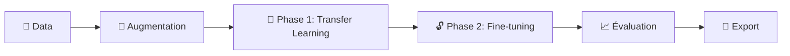

<p align="center">
  
</p>

<p align="center">
  <b>Deep Learning pour l'Inspection Optique Automatisée des Circuits Imprimés</b>
</p>

<p align="center">
  <a href="https://www.kaggle.com/datasets/akhatova/pcb-defects"></a>
  <a href="https://python.org"></a>
  <a href="https://tensorflow.org"></a>
  <a href="LICENSE"></a>
</p>

---

## 🎯 Objectif

Système de détection automatique de défauts sur circuits imprimés (PCB) utilisant le transfer learning avec **MobileNetV2**. Conçu pour l'inspection qualité en environnement industriel.

<p align="center">
  
</p>

## 🏷️ Classes de Défauts

| Défaut | Description |
|--------|-------------|
| 🕳️ `missing_hole` | Trou de perçage manquant |
| 🐭 `mouse_bite` | Bord rongé/irrégulier |
| ⚡ `open_circuit` | Circuit ouvert/interrompu |
| 🔗 `short` | Court-circuit |
| 📍 `spur` | Excroissance de cuivre |
| 🟤 `spurious_copper` | Cuivre parasite |

## 🚀 Démarrage Rapide

### Option 1 : Kaggle (Recommandé)

```python
# Une seule cellule pour tout lancer
!rm -rf /kaggle/working/pcb-defect-detector
!git clone https://github.com/alainpaluku/pcb-defect-detector.git
%cd /kaggle/working/pcb-defect-detector
!python run_kaggle.py
```

> ⚠️ **Prérequis** : Ajouter le dataset `akhatova/pcb-defects` et activer le GPU

### Option 2 : Local

```bash
# Cloner
git clone https://github.com/alainpaluku/pcb-defect-detector.git
cd pcb-defect-detector

# Installer
pip install -r requirements.txt

# Entraîner
python main.py --epochs 30 --fine-tune
```

## 🏗️ Architecture

```
┌─────────────────────────────────────────┐
│           Input (224×224×3)             │
├─────────────────────────────────────────┤
│     MobileNetV2 (ImageNet weights)      │
│         [Fine-tuned: 30 layers]         │
├─────────────────────────────────────────┤
│       GlobalAveragePooling2D            │
│         BatchNormalization              │
├─────────────────────────────────────────┤
│    Dense(128) → Dropout(0.5) → ReLU     │
│    Dense(64)  → Dropout(0.4) → ReLU     │
├─────────────────────────────────────────┤
│         Softmax (6 classes)             │
└─────────────────────────────────────────┘
```

## 📊 Pipeline d'Entraînement



| Phase | Epochs | Learning Rate | Description |
|-------|--------|---------------|-------------|
| Transfer Learning | 30 | 1e-4 | Base MobileNetV2 gelée |
| Fine-tuning | 15 | 1e-5 | 30 dernières couches dégelées |

## 📈 Résultats

| Métrique | Valeur |
|----------|--------|
| **Accuracy** | ~85% |
| **Precision** | ~87% |
| **Recall** | ~83% |
| **F1 Score** | ~85% |
| **Temps d'inférence** | ~30ms |
| **Taille du modèle** | ~14MB |

## 📁 Structure du Projet

```
pcb-defect-detector/
├── 📂 src/
│   ├── config.py           # Configuration centralisée
│   ├── data_ingestion.py   # Chargement & augmentation
│   ├── model.py            # Architecture MobileNetV2
│   └── trainer.py          # Pipeline d'entraînement
├── 📂 notebooks/
│   └── pcb_defect_detection.ipynb
├── 📂 tests/
│   └── test_model.py
├── 🐍 main.py              # Point d'entrée CLI
├── 🚀 run_kaggle.py        # Script Kaggle one-click
└── 📋 requirements.txt
```

## 💾 Fichiers Générés

Après entraînement dans `/kaggle/working/` ou `output/` :

| Fichier | Usage |
|---------|-------|
| `pcb_model.keras` | Modèle Keras (recommandé) |
| `pcb_model.h5` | Format legacy |
| `training_history.png` | Courbes d'entraînement |
| `confusion_matrix.png` | Matrice de confusion |
| `roc_curves.png` | Courbes ROC par classe |

## 🔧 Configuration

Paramètres clés dans `src/config.py` :

```python
# Modèle
IMG_SIZE = (224, 224)
BATCH_SIZE = 32
EPOCHS = 30
LEARNING_RATE = 0.0001

# Augmentation (anti-overfitting)
ROTATION_RANGE = 30
ZOOM_RANGE = 0.2
DROPOUT = 0.5

# Fine-tuning
FINE_TUNE_EPOCHS = 15
FINE_TUNE_LAYERS = 30
FINE_TUNE_LR = 1e-5
```

## � Utilisation du Modèle

```python
import tensorflow as tf
import numpy as np

# Charger
model = tf.keras.models.load_model('pcb_model.keras')

# Prédire
img = tf.keras.preprocessing.image.load_img('pcb_image.jpg', target_size=(224, 224))
img_array = np.expand_dims(tf.keras.preprocessing.image.img_to_array(img) / 255.0, 0)

prediction = model.predict(img_array)
classes = ['missing_hole', 'mouse_bite', 'open_circuit', 'short', 'spur', 'spurious_copper']
print(f"Défaut détecté: {classes[np.argmax(prediction)]}")
```

## 📚 Dataset

**[PCB Defects - Akhatova](https://www.kaggle.com/datasets/akhatova/pcb-defects)**

- 🖼️ 1386 images (693 originales + 693 rotations)
- 🏷️ 6 classes de défauts
- 📐 ~115 images par classe
- 🔍 3-5 défauts par image

## 👤 Auteur

**Alain Paluku** - [@alainpaluku](https://github.com/alainpaluku)

## 📄 Licence

MIT License - Voir [LICENSE](LICENSE)

---

<p align="center">
  <i>⭐ Star ce repo si tu le trouves utile !</i>
</p>
